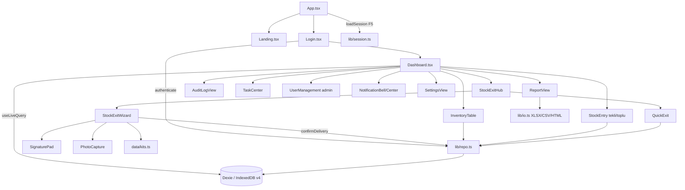
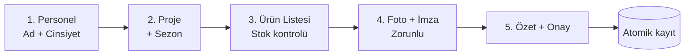

# 📦 Akıllı Depo ve Envanter Yönetim Sistemi

> **Proje Sahibi & Geliştirici: Doğukan BARA**
>
> _Alt marka:_ **Precision Logistics** — Şirket içi malzeme/kıyafet stoğunun takip edildiği; personele
> yapılan zimmet/teslimat işlemlerinin **dijital imza + fotoğraf** ile kayıt altına alındığı; tamamen
> tarayıcıda çalışan, sunucu gerektirmeyen, mobil uyumlu modern bir depo yönetim uygulaması.

Modern, hızlı ve kullanıcı dostu. **React 19 + TypeScript + Vite + Tailwind v4** ile yazıldı; veriler
**Dexie.js (IndexedDB)** üzerinde cihazda güvenle saklanır ve `useLiveQuery` ile **anlık reaktif** güncellenir.

<p align="center"><b>Hazırlayan / Geliştiren: Doğukan BARA</b></p>

---
## 📌 Proje Kimlik Bilgileri

| Bilgi | Detay |
|-------|-------|
| **Proje Adı** | Akıllı Depo ve Envanter Yönetim Sistemi |
| **Öğrenci Adı Soyadı** | Doğukan BARA |
| **Öğrenci Numarası** | 24010509058 |
| **GitHub Bağlantısı** | (https://github.com/DogukanBARA/Akilli-depo-envanter-yonetim-sistemi) |

## 📑 İçindekiler
1. [Özellikler](#-özellikler)
2. [Teknoloji Yığını](#️-teknoloji-yığını)
3. [Mimari](#️-mimari)
4. [Kurulum & Çalıştırma](#-kurulum--çalıştırma)
5. [Roller & Kullanıcı Yönetimi](#-roller--kullanıcı-yönetimi)
6. [Ekran Ekran Kullanım](#-ekran-ekran-kullanım)
7. [Çıkış Akışları](#-çıkış-akışları)
8. [Kıyafet Kit Tabloları](#-kıyafet-kit-tabloları)
9. [Veri Modeli (Dexie v4)](#-veri-modeli-dexie-v4--indexeddb)
10. [İçe / Dışa Aktarma](#-içe--dışa-aktarma)
11. [Bildirimler & Görevler](#-bildirimler--görevler)
12. [Oturum Yönetimi & Güvenlik](#-oturum-yönetimi--güvenlik)
13. [E-İmza & Fotoğraf](#-e-imza--fotoğraf)
14. [Raporlama](#-raporlama)
15. [Proje Yapısı](#-proje-yapısı)
16. [Sık Sorulanlar (SSS)](#-sık-sorulanlar-sss)
17. [Geliştirici Notları](#-geliştirici-notları)
18. [İletişim / Yazar](#-i̇letişim--yazar)

> 🧑‍💻 **Bu projenin tamamı Doğukan BARA tarafından tasarlanmış ve geliştirilmiştir.**

---

## 🚀 Özellikler

> _Bölüm sorumlusu / geliştirici: **Doğukan BARA**_

| Özellik | Açıklama |
|---|---|
| **Anlık Stok Takibi** | Ürün miktarı, kategori, konum ve kritik seviye bilgileri; veri değişince ekran **otomatik** tazelenir (Dexie `useLiveQuery`). |
| **Dexie (IndexedDB) Veri Katmanı** | Sunucusuz, gerçek **transaction** destekli kalıcı tarayıcı veritabanı. Tablolar: `inventory`, `shipments`, `auditLogs`, `deliveries`, `deliveryItems`, `tasks`, `notifications`, `users`. |
| **Kullanıcı Yönetimi (yalnız admin)** | Admin; kullanıcı **ekler / çıkarır / yetki (rol) değiştirir**. Gerçek giriş doğrulaması Dexie `users` tablosundan yapılır (sahte/sabit kullanıcı değil). Son yönetici silinemez / rolü düşürülemez. |
| **Oturum Kalıcılığı + Süre (Güvenlik)** | F5 sonrası giriş korunur; ayarlanabilir oturum süresi (30/60/120/240 dk). Süre dolunca güvenlik amacıyla otomatik çıkış. |
| **Ürün Ekleme (Tekli / Toplu)** | Tekil ürün formu **ve** çok satırlı toplu giriş gridi; aynı SKU varsa miktar otomatik artar. |
| **Toplu Giriş + Kanıt** | Toplu malzeme girişine **fatura/fotoğraf kanıtı**, tedarikçi ve not eklenebilir; tek atomik işlemde Dexie'ye yazılır. |
| **Kıyafet Kit Çıkış Sihirbazı + E-İmza/Foto** | 5 adımlı stepper: personel → proje → kıyafet listesi → foto+imza → onay. Atomik stok düşümü; **e-imza ve fotoğraf zorunlu**. |
| **Toplu / Hızlı Çıkış + Kanıt** | Sihirbaz dışında, envanterden çoklu ürün seçip tek alıcıya **hızlı toplu çıkış**; opsiyonel foto/imza kanıtı. |
| **Görev & Hatırlatıcı** | Tek seferlik **ve** tekrarlayan (günlük/haftalık) görevler; zamanı gelince **zil sesi** + görsel uyarı, düzenleme, tamamlama, silme ve **yaklaşma süresi** (lead-time) ayarı. |
| **Kalıcı Bildirim / Zil** | Okundu / sabitle / tümünü-okundu işlemleri; kritik stok ve görev uyarıları kalıcı bildirim merkezinde toplanır (dedupe ile tekrar engelleme). |
| **İçe / Dışa Aktarma** | Stok ve raporlar **XLSX / CSV / HTML** olarak içe/dışa aktarılır (tamamı tarayıcıda, `xlsx`/SheetJS). |
| **Mobil-Uyumlu Markalı HTML Rapor** | Yazdırmaya hazır, antetli, mobilde karta dönüşen duyarlı HTML rapor çıktısı. |
| **Günlük Detaylı Hareket Raporu** | Seçilen güne ait tüm giriş+çıkış hareketleri (tip, ürün, adet, personel, alıcı, konum, saat). Rapor türleri: Teslimatlar · Günlük Hareketler · Stok Envanteri. |
| **Kritik Stok Uyarıları** | Stok kritik seviyenin altına düşünce görsel modal + kalıcı bildirim + (opsiyonel) e-posta tetikleme logu. |
| **Rol Tabanlı Erişim (RBAC)** | Yönetici / Depocu. Rapor, Denetim Günlüğü ve Kullanıcı Yönetimi yalnız yöneticide. |
| **Denetim Günlüğü (Audit Log)** | Tüm kritik işlemlerin tarih/saat/kullanıcı/tip bazlı kaydı (son 1000); renkli rozetler + filtre. |
| **Grafikler** | `recharts` ile kategori bazlı stok ve hareket özetleri. |
| **Karanlık Mod** | Tüm arayüzde gece/gündüz teması. |
| **Responsive** | Mobile-first; mobilde alt navigasyon, masaüstünde üst navbar. |
| **Offline / Yerel** | Sunucu yok — veriler tarayıcıda (IndexedDB). İnternet olmadan çalışır. |

---

## 🛠️ Teknoloji Yığını

| Katman | Teknoloji |
|---|---|
| Çatı | **React 19** + **TypeScript** |
| Derleme | **Vite 6** |
| Stil | **Tailwind CSS v4** (`@theme`, `tailwind.config.js` yok) |
| Font | **Inter** (gövde) + **Manrope** (başlık) |
| Animasyon | **motion** (Framer Motion) — _GSAP/ScrollTrigger kullanılmaz_ |
| İkonlar | **lucide-react** |
| Grafik | **recharts** |
| Veri | **Dexie.js** (IndexedDB) + **dexie-react-hooks** (`useLiveQuery`) |
| Excel/IO | **xlsx** (SheetJS, client-side) — XLSX / CSV / HTML |
| E-İmza | Bağımlılıksız `<canvas>` + Pointer Events |
| Zil/Bildirim | Web Audio API (oscillator beep) + (opsiyonel) `Notification` |

---

## 🏗️ Mimari

> _Mimari & veri katmanı tasarımı: **Doğukan BARA**_



**Veri akışı ilkesi:** Bileşenler veriyi **okumak** için `useLiveQuery(() => db.<tablo>...)`, **yazmak**
için `repo.ts` fonksiyonlarını kullanır. Bileşenler doğrudan Dexie'ye yazmaz. Bu sayede ileride gerçek bir
backend (SQLite/Postgres/REST) gerekirse **yalnız `repo.ts` ve `db.ts`** değişir; arayüz aynı kalır.

---

## 📦 Kurulum & Çalıştırma

```bash
# 1) Bağımlılıkları yükle
npm install

# 2) Geliştirme sunucusu (http://localhost:3000)
npm run dev

# 3) Üretim derlemesi (dist/)
npm run build

# 4) Üretim önizleme
npm run preview

# 5) Tip kontrolü
npm run lint     # tsc --noEmit
```

> **Not:** Uygulama ilk açılışta otomatik olarak gerçekçi bir **demo envanteri**, sistem **görevleri**
> ve varsayılan **kullanıcı hesaplarını** (idempotent) yükler. "Ayarlar → Verileri Sıfırla" sonrası
> demo envanter tekrar yüklenmez.

---

## 👥 Roller & Kullanıcı Yönetimi

> _Bu modül **Doğukan BARA** tarafından geliştirilmiştir._

Kullanıcılar Dexie `users` tablosunda saklanır; giriş **gerçek** doğrulama ile yapılır
(`repo.authenticate(username, password)`). Admin, **Kullanıcı Yönetimi** ekranından hesap **ekler,
çıkarır ve rolünü değiştirir**.

| Yetki | 🛡️ Yönetici (`admin`) | 📦 Depocu (`personnel`) |
|---|:---:|:---:|
| Stok görüntüleme | ✅ | ✅ |
| Malzeme girişi / ürün ekleme (tekli + toplu + kanıt) | ✅ | ✅ |
| Malzeme çıkışı (kit sihirbazı + hızlı toplu çıkış) | ✅ | ✅ |
| Görev & Hatırlatıcı | ✅ | ✅ |
| Bildirimler / Zil | ✅ | ✅ |
| Genel Rapor ekranı + indirme (XLSX/CSV/HTML) | ✅ | ❌ |
| Denetim Günlüğü | ✅ | ❌ |
| **Kullanıcı Yönetimi (ekle/çıkar/yetki)** | ✅ | ❌ |
| Verileri Sıfırla | ✅ | ❌ |

**Demo giriş bilgileri:**

| Rol | Ad | Kullanıcı | Şifre |
|---|---|---|---|
| 🛡️ Yönetici | Doğukan BARA | `admin` | `admin123` |
| 📦 Depocu | Hasan Koçak | `depocu` | `depocu123` |

> 2FA etkinse kod: **`123456`**

**Güvenlik kuralları:**
- Son **yönetici silinemez** ve rolü düşürülemez (kilitlenme önlemi).
- Kullanıcı adı benzersizdir (`&username` indeks); büyük/küçük harf toleranslıdır.
- Tüm kullanıcı işlemleri (ekleme/silme/güncelleme) `security` tipiyle **denetim günlüğüne** yazılır.

> Rol kontrolü **çift katmanlıdır**: arayüzde menü gizlenir **ve** ilgili ekran/işlem rolü tekrar doğrular.

---

## 🖥️ Ekran Ekran Kullanım

1. **Landing (Tanıtım):** Uygulama açılır, özellikleri tanıtan sayfa görünür → **"Giriş Yap"**.
2. **Giriş:** Rol seç, kullanıcı/şifre (+2FA) → `authenticate` ile doğrulanır → panele geçiş.
3. **Panel (Dashboard):** Karşılama, hızlı erişim kartları (Stok, Giriş, Çıkış, Ürün Ekle, Denetim*),
   verimlilik kartı, **aktif görevler** ve **bildirim zili**. *(Denetim/Kullanıcılar yalnız yönetici)*
4. **Stok Takibi:** Envanter tablosu; arama + kategori/konum filtresi; **kritik stok** satırları kırmızı vurgulu; hızlı giriş/çıkış; dışa/içe aktarma.
5. **Malzeme Girişi:** **Tekli / Toplu** sekmesi; tedarikçi, not ve **fatura/foto kanıtı**.
6. **Malzeme Çıkışı:** Mod seçimi — **Kit Sihirbazı** veya **Hızlı Toplu Çıkış** (aşağıda).
7. **Görevler:** Görev/hatırlatıcı ekle, tekrar/zil ayarla, tamamla/sil; "Tümünü Gör" buraya açılır.
8. **Bildirimler (Zil):** Okundu/sabitle/tümü; kritik stok ve görev uyarıları.
9. **Raporlar (yönetici):** Rapor türü seç (Teslimatlar/Günlük Hareketler/Stok); filtre + kanıt görüntüleme + XLSX/CSV/HTML indir + grafikler.
10. **Denetim Günlüğü (yönetici):** Renkli tip rozetleri, arama/filtre.
11. **Kullanıcılar (yönetici):** Hesap ekle/çıkar, rol değiştir.
12. **Ayarlar:** Karanlık mod, bildirimler, 2FA, **oturum süresi**, görev yaklaşma süresi, e-posta bildirimi, (yönetici) veri sıfırlama.
13. **Profil:** Kullanıcı bilgileri ve çıkış.

---

## 🧭 Çıkış Akışları

> _Çıkış akışları & atomik stok mantığı: **Doğukan BARA**_

Çıkış ekranı iki mod sunar (`StockExitHub`):

### 1) Kıyafet Kit Çıkış Sihirbazı (`StockExitWizard`)



1. **Personel:** Teslim alan ad-soyad + cinsiyet (Erkek/Kadın).
2. **Proje:** *Temizlik* (→ Yazlık/Kışlık) veya *Tüm ve Çay*.
3. **Ürün Listesi:** Kit otomatik gelir, cinsiyete göre filtrelenir; adetler düzenlenebilir.
   **Stok yetersizse satır kırmızı olur ve ileri geçiş bloklanır** — stok asla eksiye düşmez.
4. **Foto + İmza:** Fotoğraf (kamera/dosya) **ve** e-imza **zorunludur**.
5. **Özet + Onay:** Tek **transaction**: stok düşümü + çıkış hareketleri + teslimat kaydı + denetim logu. Hata olursa tüm işlem geri alınır.

### 2) Hızlı Toplu Çıkış (`QuickExit`)

- Envanterden **çoklu ürün + adet** seçimi, tek alıcı adı, **opsiyonel** foto/imza kanıtı.
- `repo.quickExit(...)` ile tek atomik transaction; her satırda stok ön-kontrolü (eksiye düşmez).

---

## 👕 Kıyafet Kit Tabloları

### Temizlik — Yazlık
| Ürün | Adet | Not |
|---|---|---|
| Tişört | 2 | |
| Pantolon | 2 | |
| Ayakkabı | 1 | |
| Eşarp | 1 | Sadece kadın |

### Temizlik — Kışlık
| Ürün | Adet | Not |
|---|---|---|
| Tişört | 2 | |
| Pantolon | 2 | |
| Ayakkabı | 1 | |
| Polar | 1 | |
| Mont | 1 | |
| Boyunluk | 1 | |
| Eşarp | 1 | Sadece kadın |

### Tüm ve Çay (yaz/kış ayrımı yok)
| Ürün | Adet | Not |
|---|---|---|
| Gömlek | 2 | |
| Pantolon | 2 | |
| Ayakkabı | 1 | |
| Yelek | 1 | |
| Kravat | 1 | Sadece erkek |
| Fular | 1 | Sadece kadın |

> Kitler `src/data/kits.ts` içinde tanımlıdır; yeni proje/sezon eklemek bu dosyaya satır eklemekle olur.

---

## 🗄️ Veri Modeli (Dexie v4 / IndexedDB)

> _Şema tasarımı: **Doğukan BARA**_

Veritabanı adı: **`wmsDB`**. Sürüm geçmişi (her sürüm öncekileri korur):

| Sürüm | Eklenen Tablo(lar) |
|---|---|
| **v1** | `inventory`, `shipments`, `auditLogs`, `deliveries`, `deliveryItems` |
| **v2** | `tasks` (görev & hatırlatıcı) |
| **v3** | `notifications` (kalıcı bildirim / zil) |
| **v4** | `users` (kullanıcı hesapları — admin yönetir) |

| Tablo | Anahtar + İndeksler | Açıklama |
|---|---|---|
| `inventory` | `id, sku, name, category, location, quantity` | Stok kalemleri |
| `shipments` | `id, ts, type, date, category, personnel` | Giriş/çıkış hareketleri (opsiyonel `photoDataUrl`, `note`, `supplier` kanıt alanları) |
| `auditLogs` | `id, ts, user, type` | Denetim günlüğü (son 1000) |
| `deliveries` | `id, ts, project, receiverGender` | Teslimat (zimmet) kayıtları (foto/imza dataURL gömülü) |
| `deliveryItems` | `++autoId, deliveryId, itemId` | Teslimat kalemleri (normalize) |
| `tasks` | `id, ts, dueAt, done` | Görev & hatırlatıcı (tekrar/zil/yaklaşma) |
| `notifications` | `id, ts, read, pinned, dedupeKey` | Kalıcı bildirim/zil (en fazla 200; sabitler korunur) |
| `users` | `id, &username, role` | Kullanıcı hesapları (benzersiz kullanıcı adı) |

**Atomiklik:** Giriş/çıkış/teslimat/toplu işlemler `db.transaction('rw', ...)` içinde yapılır — ya hepsi
başarılı olur ya hiçbiri (stok tutarsızlığı önlenir).

**Migrasyon:** İlk açılışta eski `localStorage` verisi (varsa) otomatik Dexie'ye taşınır; ayar/profil
tercihleri (`darkMode`, 2FA, oturum süresi, e-posta vb.) localStorage'da kalmaya devam eder.

---

## 🔄 İçe / Dışa Aktarma

> _IO katmanı (`lib/io.ts`): **Doğukan BARA**_

- **Dışa aktarma:** Stok ve raporlar **XLSX**, **CSV** (UTF-8 BOM, `;` ayraç) ve **markalı HTML** olarak indirilir.
- Tüm indirmeler `Blob + anchor` ile yapılır (sandbox/iframe ortamlarında güvenli).
- **HTML rapor** (`buildBrandedHTML`): antetli, yazdırmaya hazır, **mobilde karta dönüşen** duyarlı tablo;
  köşede "Precision Logistics — Akıllı Depo ve Envanter Yönetim Sistemi" antet imzası.
- **İçe aktarma:** XLSX/CSV dosyaları esnek başlık eşleme (TR/EN, büyük/küçük harf toleranslı) ile ayrıştırılır.
  Modlar: **Üzerine Ekle** (`add`), **Güncelle** (`upsert`), **Tümünü Değiştir** (`replace`) — tümü atomik.
- Boş **şablon** (başlık + örnek satır) indirme desteklenir.

| Rapor sütunları (örnek) | |
|---|---|
| Teslimat | Teslim Eden · Teslim Alan · Proje · Alt Tür · Ürünler · Toplam Adet · Tarih · Kanıt |
| Günlük Hareket | Saat · Tip · Ürün · Adet · Personel · Alıcı · Konum |
| Stok Envanteri | Ürün Adı · SKU · Kategori · Adet · Birim · Konum · Kritik Seviye · SKT · Son Güncelleme |

---

## 🔔 Bildirimler & Görevler

> _Görev/zil altyapısı: **Doğukan BARA**_

### Görev & Hatırlatıcı (`TaskCenter`)
- **Tek seferlik** ve **tekrarlayan** (günlük/haftalık + belirli gün) görevler.
- Görev başlığı, not, tarih-saat, tekrar, **zil aç/kapa**, **düzenleme**, tamamlama, silme.
- **Zamanlayıcı** (Dashboard'da, her zaman mount): ~30 sn'de bir `dueAt <= now` görevleri bulur →
  **Web Audio API beep** + görsel uyarı + bildirim; tekrarlayan görevlerde `dueAt` bir sonraki güne/haftaya ötelenir.
- **Yaklaşma süresi (lead-time):** Ayarlardan görev hatırlatma önceliği ayarlanır.

### Kalıcı Bildirim / Zil (`NotificationBell` + `NotificationCenter`)
- Kritik stok ve görev uyarıları kalıcı bildirim merkezinde toplanır.
- **Okundu**, **sabitle**, **tümünü okundu**, sil, okunmuşları temizle.
- `dedupeKey` ile aynı uyarının tekrar tekrar eklenmesi engellenir; en fazla 200 kayıt (sabitler korunur).

---

## 🔐 Oturum Yönetimi & Güvenlik

> _Oturum katmanı (`lib/session.ts`): **Doğukan BARA**_

- **Kalıcı giriş:** F5 sonrası giriş açıksa doğrudan Dashboard açılır (Landing/Login atlanır).
- **Oturum süresi:** Ayarlardan 30 / 60 / 120 / 240 dk seçilir; `localStorage['wms_auth'] = { role, loginAt, expiresAt }`.
- **Otomatik çıkış:** Süre dolunca oturum temizlenir ve Login'e dönülür. Dashboard periyodik kontrol eder.
- **Güvenlik notu (Ayarlar'da gösterilir):** _"Oturum süresi, paylaşılan cihazlarda yetkisiz erişimi önlemek
  için güvenlik amacıyla sınırlanır. Süre dolduğunda yeniden giriş gerekir."_

---

## ✍️ E-İmza & Fotoğraf

- **İmza** (`SignaturePad.tsx`): tam ekran modal, Pointer Events (mouse + dokunmatik tek kod yolu),
  `devicePixelRatio` ile retina netliği, boş canvas'ta "Onayla" pasif. PNG `toDataURL` ile üretilir.
- **Fotoğraf** (`PhotoCapture.tsx`): `<input type="file" accept="image/*" capture="environment">` ile
  mobilde kamera; ~2MB üzeri görseller canvas ile max 1280px + JPEG %80 sıkıştırılır.
- Her ikisi de **base64 dataURL** olarak teslimat/hareket kaydına gömülür (ayrı dosya/sunucu gerekmez).

---

## 📊 Raporlama

> _Rapor modülü: **Doğukan BARA**_

- **Rapor türleri:** Teslimatlar · **Günlük Detaylı Hareket** · Stok Envanteri.
- Filtreler (tarih/proje/personel); "Raporu İndir" butonu **indirilebilir veri varsa aktif** (0 satırda pasif).
- Çıktı formatları: **XLSX / CSV / HTML** (markalı, mobil-uyumlu).
- Kanıt (foto/imza) uygulama içi modalda görüntülenir.
- `recharts` ile kategori/hareket özetleri.

---

## 📁 Proje Yapısı

```
src/
├─ App.tsx                  # Landing → Login → Dashboard akışı + oturum kalıcılığı
├─ main.tsx, index.css      # giriş + Tailwind tema/font (Inter + Manrope)
├─ types.ts                 # tüm TypeScript arayüzleri
├─ lib/
│  ├─ db.ts                 # Dexie şema (wmsDB v1–v4)
│  ├─ repo.ts               # repository — TEK veri yazma noktası + auth/kullanıcı CRUD
│  ├─ io.ts                 # XLSX/CSV/HTML dışa + içe aktarma
│  └─ session.ts            # kalıcı oturum + süre
├─ data/
│  ├─ kits.ts               # kıyafet kit sabitleri + getKit()
│  ├─ categories.ts         # kategori / birim / konum listeleri
│  ├─ seed.ts               # demo başlangıç verisi
│  └─ taskSeed.ts           # tekrarlayan + tek seferlik sistem görevleri
└─ components/
   ├─ Landing.tsx           # tanıtım sayfası
   ├─ Login.tsx             # giriş + rol seçimi + 2FA (gerçek auth)
   ├─ Dashboard.tsx         # ana kabuk + navigasyon + veri katmanı + zamanlayıcı
   ├─ InventoryTable.tsx    # stok tablosu + içe/dışa aktarma
   ├─ ProductForm.tsx       # ürün ekleme
   ├─ StockEntry.tsx        # tekli/toplu giriş + kanıt
   ├─ StockExitHub.tsx      # çıkış mod seçici
   ├─ StockExitWizard.tsx   # 5 adımlı kit çıkış sihirbazı
   ├─ QuickExit.tsx         # hızlı toplu çıkış
   ├─ SignaturePad.tsx      # canvas e-imza
   ├─ PhotoCapture.tsx      # fotoğraf çekme/yükleme
   ├─ ShipmentTable.tsx     # giriş/çıkış hareket listesi
   ├─ ReportView.tsx        # rapor + XLSX/CSV/HTML + grafikler
   ├─ AuditLogView.tsx      # denetim günlüğü
   ├─ TaskCenter.tsx        # görev & hatırlatıcı
   ├─ NotificationBell.tsx  # zil
   ├─ NotificationCenter.tsx# bildirim merkezi
   ├─ UserManagement.tsx    # kullanıcı yönetimi (admin)
   ├─ SettingsView.tsx      # ayarlar (oturum süresi, lead-time, ...)
   └─ ProfileView.tsx       # profil

plans/                      # detaylı plan dökümanları (bkz. plans/_NAVIGASYON.md)
```

---

## ❓ Sık Sorulanlar (SSS)

**Verilerim nerede saklanıyor?** Tarayıcınızın IndexedDB'sinde (cihazınızda). Sunucuya gönderilmez.

**Giriş gerçek mi yoksa sahte mi?** Gerçek — kullanıcılar `users` tablosunda tutulur, giriş `authenticate` ile doğrulanır.

**Yeni kullanıcı nasıl eklerim?** Yönetici olarak **Kullanıcılar** ekranından ekle/çıkar/yetki değiştir.

**Sayfayı yenileyince çıkış oluyor mu?** Hayır — oturum kalıcıdır; yalnız süre dolunca güvenlik amacıyla çıkış olur.

**Stok eksiye düşer mi?** Hayır. Çıkış/teslimat/toplu işlemlerde yetersiz stok işlemi bloklar (atomik).

**İnternet gerekir mi?** Hayır; yalnız fontlar ve örnek görseller harici kaynaktan gelir. Çekirdek çevrimdışı çalışır.

**Rapor/Excel nasıl üretiliyor?** Tamamen tarayıcıda (`xlsx`/SheetJS); XLSX/CSV/HTML olarak anında indirilir.

**Görev zili neden çalmıyor olabilir?** İlgili görevde `sound` kapalı olabilir veya tarayıcı ses iznini geciktirmiş olabilir.

---

## 👨‍💻 Geliştirici Notları

- **Veri yazımı her zaman `repo.ts` üzerinden** yapılır; bileşenler doğrudan Dexie'ye yazmaz.
- **Font Inter/Manrope** bu projeye özeldir; `src/index.css` `@theme` bloğu değiştirilmez.
- Animasyonlar **`motion`** ile; **GSAP/ScrollTrigger kullanılmaz**.
- Tasarım paleti: `#455f8a` `#244069` `#d6e3ff` `#d9d7f8` `#d3e4fe` `#566166` `#f0f4f7` `#2a3439`.
- Plan dökümanları ve kırmızı çizgiler: **`plans/_NAVIGASYON.md`** ve **`plans/UNUTULMAMASI-GEREKENLER.md`**.
- Üretim derlemesi tek büyük chunk üretir (xlsx + recharts + motion). Gerekirse `manualChunks` / dinamik `import()` ile bölünebilir.

---

## 📬 İletişim / Yazar

| | |
|---|---|
| **Proje Sahibi & Geliştirici** | **Doğukan BARA** |
| Marka | Precision Logistics |
| Ürün | Akıllı Depo ve Envanter Yönetim Sistemi |

> Bu yazılımın tasarımı, mimarisi ve tüm modülleri **Doğukan BARA** tarafından geliştirilmiştir.

---

<p align="center"><sub><b>Akıllı Depo ve Envanter Yönetim Sistemi</b> · Precision Logistics · React 19 · Dexie · Vite · Tailwind v4<br/>© Geliştiren: <b>Doğukan BARA</b></sub></p>
